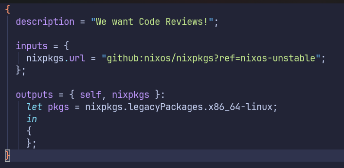
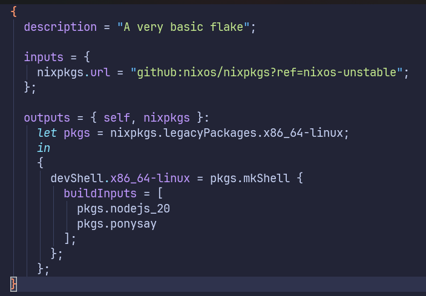
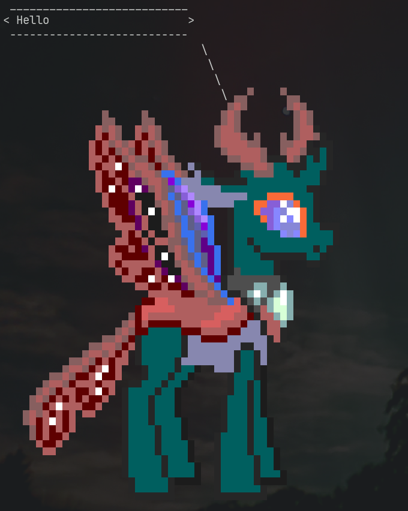

Our goal is to create a developer shell that will allows us to have multiple environments depending on the project we are working at the moment.

In order to do this, first start by removing everything inside the **outputs** section. Then, add the following lines to it.

```
outputs = {self, nixpkgs} :
let pkgs = nixpkgs.legacyPackages.x86_64-linux;
in
{

};
```

This is how the nix flake file should look like after you modified it:



This is a way to create the variable *pkgs* so that we don't need to repeat the *nixpkgs.legacyPackages.x86_64-linux* string everytime.

Inside the `in {...};` section is where we will define what the flake will return. In our case we want to create a simple *devShell* so let's do that by adding the following lines.

```
devShell.x86_64-linux = pkgs.mkShell {
  buildInputs = [
  ];
};
```

This will create a shell for a Linux x86_64. You can add packages by declaring them like `pkgs.<package_name>`. For example let's add *ponysay* and *nodejs* as an example.

```
buildInputs = [
  pkgs.ponysay
  pkgs.nodejs_20
];
```

This is how your nix flake file should look like by now:



In order to start your new shell, you need to run the command `nix develop`. When we run this command a `flake.lock` file will be created which we will explain further in the tutorial.

For now, you can try to use the newly installed packages by using for example `ponysay "Hello"`{{exec}} or `node --version`{{exec}}. Also note that the previously installed packages are still present, try to run `cowsay "Hello"`{{exec}}.



You can exit the shell by typing `exit` or using `Ctrl + D`.
