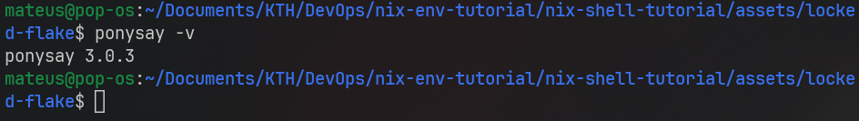
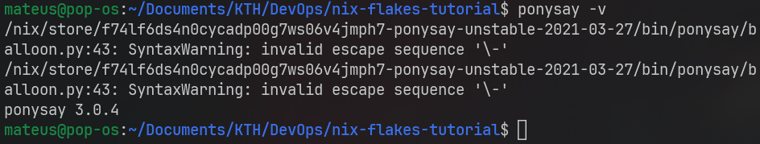

While using the command `nix develop` we saw that there is a file that gets created, **flake.lock**. This file is what makes the nix shell so useful.

Imagine you have a certain project in a team and you manage to get it working on your machine. Now you want to share it with a colleague but want to be sure that all the package versions are the same between you and them. You could just share the **flake.nix** file but imagine that your NixPkgs repository is a bit different than your colleague? This would mean that you and your colleague would have different versions of packages. This is where the **flake.lock** file comes in. It locks the specific versions (or commits) of the dependencies used by your nix flake meaning that both you and your colleague will be pulling the packages from the same repository version.

If you ever spent time working in a team you know how useful this can be. Ensuring that everyone has the same versions for everything is super important in software development.

Let's try to use this feature now. Go into the `cd ~/locked-flake/`{{exec}} directory and take a look at the **flake.nix** file. Here we forced the *nixpkgs* to point to an earlier release (20.03) than the latest one. This is so that we can see an actual change in the package versioning.

Again, start the shell with `nix develop`{{exec}} and check the version of *ponysay* by running `ponysay --version`{{exec}}

Now, exit the nix shell and try to check the *ponysay* version of the flake you created.

As you can see, the version of the package is different. Even if you run `nix flake update` the package version will be different because the flake.lock file is pinning the version of the packages to run.
