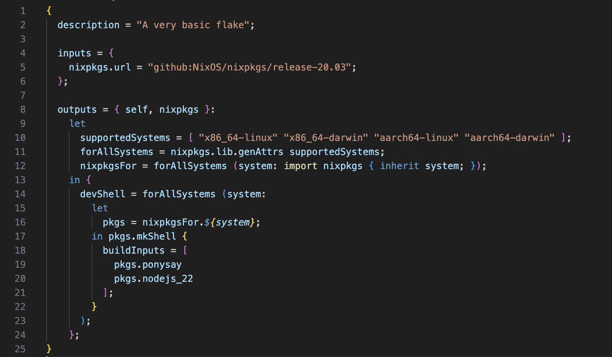

In this step, we are adapting the Nix flake and defining packages for multiple systems. This is useful when you need to support different operating systems or architectures, while maintaining the same development environment. 

To do this we need to modify the **flake.nix** file. First we have to declare the systems we're going to use. This is done by adding the supported systems in a list. We're creating a list called supported systems under the outputs. For this example, let say that we will support both x86_64 and ARM architectures for Linux and macOS.
We first start by removing everything inside the **outputs** section, and then adding the following line. 
```
  outputs = { self, nixpkgs }:
    let 
      supportedSystems = [ "x86_64-linux" "x86_64-darwin" "aarch64-linux" "aarch64-darwin" ];
```

 The next step is to map each system to a Nixpkgs package set. This is done using the function *genAttrs*. This generates an attribute set for each system in the *supportedSystems* list. The following line will generate this. 
```
      forAllSystems = nixpkgs.lib.genAttrs supportedSystems;
```
 
  The *forAllSystems* function ensures that we can define packages for each system independently and allows each system to map to the correct Nixpkgs package set. 
 
 ```
        nixpkgsFor = forAllSystems (system: import nixpkgs { inherit system; });

```
 
Finally we need to define which packages we want to include in the development shell. This is done inside the `in {...};` section. Like the previous step, this example will install *ponysay* and *nodejs* across all systems, by adding them to the *buildInputs* of the *devShell*. 
 ```
in {
      devShell = forAllSystems (system:
        let
          pkgs = nixpkgsFor.${system};
        in pkgs.mkShell {
          buildInputs = [
            pkgs.ponysay
            pkgs.nodejs_20
          ];
        }
      );
    };


```
By now the file should look like this: 

